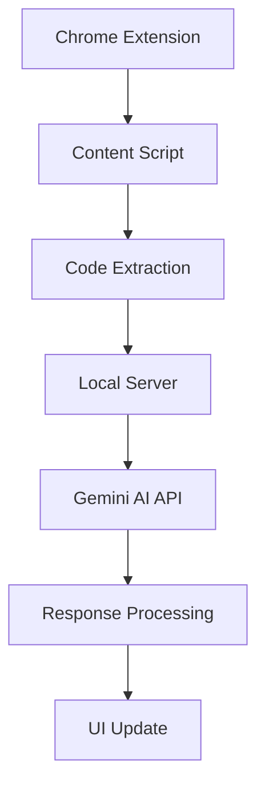

# 🧠 CodeHint AI

<div align="center">


**Your Intelligent Coding Companion for Competitive Programming**

[](https://chrome.google.com/webstore)
[](https://nodejs.org/)
[](https://ai.google.dev/)
[](https://opensource.org/licenses/MIT)

*Elevate your coding experience with intelligent hints, complexity analysis, and real-time code insights*

[🚀 Quick Start](#-quick-start) • [✨ Features](#-features) • [📖 Usage](#-usage) • [🛠️ Development](#️-development) • [📋 FAQ](#-faq)

</div>

---

## 🚀 Latest Updates

### ✨ Version 2.0 - Enhanced Code Extraction & Compact UI

**🔧 Major Code Extraction Improvements:**
- **Complete Code Capture**: Now extracts your entire code, including content scrolled out of view
- **Dual-Strategy System**: Content script + direct injection for maximum reliability
- **7+ Extraction Methods**: Monaco API, ACE Editor, CodeMirror, React Fiber, and more
- **Platform Optimization**: Specialized extraction for each coding platform
- **Debug Logging**: Built-in troubleshooting with detailed console logs

**🎨 UI/UX Enhancements:**
- **Ultra-Compact Design**: Removed unnecessary elements for professional minimal look
- **30% Less Header Space**: Streamlined header without subtitle and status indicators
- **Optimized Chat Area**: Reduced padding and height for better space utilization
- **Modern Glassmorphic Effects**: Enhanced visual appeal with backdrop blur

**🐛 Bug Fixes:**
- Fixed file corruption issues during development
- Improved error handling and user feedback
- Enhanced button states and loading indicators

---

## 🌟 Overview

CodeHint AI is a sophisticated Chrome extension that transforms your competitive programming experience. Powered by Google's Gemini AI, it provides intelligent, context-aware assistance while you solve coding challenges on popular platforms.

### 🎯 Why CodeHint AI?

- **🧠 Complete Code Analysis**: Advanced extraction technology captures your entire code, including scrolled content
- **⚡ Instant Insights**: Get hints and complexity analysis in seconds with dual-strategy extraction
- **🎨 Ultra-Compact UI**: Professional, minimal design optimized for maximum efficiency
- **🔒 Privacy First**: Your code stays local - only minimal context is sent to AI
- **🌐 Multi-Platform**: Enhanced support for LeetCode, GeeksforGeeks, and Codeforces
- **🛠️ Bulletproof Extraction**: 7+ extraction methods ensure code is captured on any platform

---

## ✨ Features

## ✨ Features

### 🚀 Core Functionality

| Feature | Description | Benefit |
|---------|-------------|---------|
| **💡 Smart Hints** | Context-aware hints based on your complete code | Get unstuck without spoiling the solution |
| **⏱️ Time Complexity** | Instant Big O analysis of your algorithms | Optimize performance before submission |
| **💾 Space Complexity** | Memory usage analysis and optimization tips | Write memory-efficient solutions |
| **🔍 Advanced Code Detection** | Complete code extraction including scrolled content | Analyzes your entire code, not just visible parts |
| **💬 Interactive Chat** | Ask specific questions about your approach | Get personalized guidance |

### 🎨 User Experience

- **🌙 Compact Modern UI**: Ultra-clean, minimal design with glassmorphic effects
- **⚡ Smooth Animations**: Bouncing emojis and fade-in effects
- **📱 Space-Efficient Design**: Optimized for maximum usability in minimal space
- **🎭 Visual Feedback**: Real-time loading states and button animations
- **🔄 Smart Scrolling**: Auto-scroll to latest messages

### 🛡️ Enhanced Code Extraction

- **📜 Complete Code Capture**: Extracts entire code including scrolled content
- **🔧 Multiple Editor Support**: Monaco, ACE, CodeMirror, and textarea detection
- **🎯 Platform Optimized**: Specific extraction methods for each coding platform
- **🔄 Dual Strategy**: Content script + direct injection for maximum reliability
- **🐛 Debug Logging**: Console logs for troubleshooting extraction issues

- **🔐 Local Processing**: Code analysis happens locally when possible
- **🚫 No Data Storage**: No conversation history stored permanently
- **🔑 API Key Security**: Your Gemini API key stays in your environment
- **🛡️ Secure Communication**: HTTPS-only API communications
- **📊 Smart Extraction**: Only sends necessary code context to AI

### 🔧 Advanced Code Extraction Technology

CodeHint AI features a sophisticated **dual-strategy code extraction system** that ensures complete code capture:

#### 🎯 Complete Code Detection
- **📜 Full Content Extraction**: Captures your entire code, including content above/below the visible viewport
- **🔄 Scrolled Content Support**: Never misses code that's scrolled out of view
- **📱 Viewport Independent**: Works regardless of editor size or screen resolution

#### 🛠️ Multi-Method Extraction
1. **Monaco Editor API**: Direct access to editor models (`window.monaco.editor.getEditors()`)
2. **ACE Editor Support**: Full integration with ACE-based editors
3. **CodeMirror Detection**: Native CodeMirror instance access
4. **React Fiber Traversal**: Advanced React component tree navigation
5. **Enhanced Textarea Search**: 14+ specialized selector patterns
6. **Global Variable Detection**: Finds editor instances in window scope
7. **DOM Property Access**: Direct editor instance access via DOM properties

#### 🔍 Platform-Specific Optimizations
- **LeetCode**: Monaco API + React integration + enhanced fallbacks
- **GeeksforGeeks**: Multi-method textarea detection + Monaco support
- **Codeforces**: ACE Editor + textarea + Monaco compatibility
- **Generic Platforms**: Universal extraction with 7+ fallback methods

#### 🐛 Built-in Debugging
- Console logging shows extraction method used and code length
- Automatic fallback chain when primary methods fail
- Real-time editor detection and availability reporting

---

## 🚀 Quick Start

### Prerequisites

Before you begin, ensure you have:

- **Node.js 18+** ([Download](https://nodejs.org/))
- **Google Chrome Browser**
- **Gemini API Key** ([Get yours free](https://ai.google.dev/))

### 📦 Installation

1. **Clone the Repository**
   ```bash
   git clone https://github.com/yourusername/CodeHint.git
   cd CodeHint
   ```

2. **Install Dependencies**
   ```bash
   npm install
   ```

3. **Configure Environment**
   ```bash
   # Create .env file
   echo "GEMINI_API_KEY=your_api_key_here" > .env
   ```

4. **Start the Server**
   ```bash
   # Option 1: npm script
   npm start
   
   # Option 2: Batch file (Windows)
   start-server.bat
   
   # Option 3: PowerShell (Windows)
   .\start-server.ps1
   ```

5. **Load Chrome Extension**
   - Open `chrome://extensions/`
   - Enable "Developer mode"
   - Click "Load unpacked"
   - Select the `CodeHint` folder

---

## 📖 Usage

### 🎯 Getting Started

1. **Navigate** to any coding platform:
   - 🟢 LeetCode (`leetcode.com/problems/`)
   - 🔵 GeeksforGeeks (`geeksforgeeks.org/`)
   - 🟡 Codeforces (`codeforces.com/`)

2. **Write your code** in the platform's editor

3. **Click the CodeHint AI icon** in your browser toolbar

4. **Choose your action**:
   - 💡 **Get Smart Hint** - Receive intelligent guidance
   - ⏱️ **Time O(?)** - Analyze time complexity
   - 💾 **Space O(?)** - Analyze space complexity

### 💬 Interactive Features

- **Ask Questions**: Type specific questions in the input field
- **Real-time Analysis**: Get instant feedback on your code
- **Progressive Hints**: Start with subtle hints, get more detailed help
- **Error Guidance**: Understand and fix common coding mistakes

### 🎨 Compact UI Design

CodeHint AI features an ultra-compact, professional interface optimized for efficiency:

```
┌─────────────────────────────────┐
│ 🧠 CodeHint AI                  │  ← Minimal header (no subtitle/status)
├─────────────────────────────────┤
│     📋 Ready to Analyze         │  ← Compact chat area (reduced height)
│  Write your code and get        │
│     instant insights            │
├─────────────────────────────────┤
│ Ask me anything about your code │  ← Input field
├─────────────────────────────────┤
│        💡 Get Smart Hint        │  ← Primary action button
├─────────────────────────────────┤
│  ⏱️ Time O(?)  │ 💾 Space O(?)  │  ← Dual complexity buttons
└─────────────────────────────────┘
```

#### 🎯 Design Improvements
- **Minimal Header**: Removed unnecessary subtitle and live status for cleaner look
- **Compact Chat Area**: Reduced height (28 → 24) and padding for more space efficiency
- **Professional Spacing**: Optimized padding throughout for modern feel
- **Glassmorphic Effects**: Beautiful backdrop blur and transparency effects
- **Smooth Animations**: Bouncing emojis and hover effects for engagement

---

## 🛠️ Development

### 🏗️ Architecture



### 📁 Project Structure

```
CodeHint/
├── 📁 icons/                 # Extension icons
│   ├── icon16.png
│   ├── icon48.png
│   └── icon128.png
├── 📄 manifest.json          # Extension manifest
├── 📄 popup.html             # Main UI interface
├── 📄 popup.js               # Frontend logic
├── 📄 content.js             # Code extraction
├── 📄 background.js          # Service worker
├── 📄 server.mjs             # AI backend server
├── 📄 package.json           # Dependencies
├── 📄 .env                   # Environment variables
└── 📄 README.md              # This file
```

### 🔧 Key Components

#### Frontend (Extension)
- **popup.html**: Modern glassmorphic UI with Tailwind CSS
- **popup.js**: Event handling, API communication, UI updates
- **content.js**: Intelligent code extraction from various editors

#### Backend (Node.js Server)
- **server.mjs**: Express server with Gemini AI integration
- **AI Prompts**: Carefully crafted prompts for optimal responses
- **Error Handling**: Robust error management and logging

### 🚀 Development Workflow

1. **Make Changes** to any file
2. **Restart Server** (if backend changes):
   ```bash
   npm start
   ```
3. **Reload Extension** in `chrome://extensions/`
4. **Test Features** on supported platforms

### 🧪 Testing

```bash
# Run the test server
npm run test

# Check server health
curl http://localhost:3000/health
```

---

## 🎨 Customization

### 🎭 UI Themes

Modify the CSS variables in `popup.html`:

```css
:root {
  --primary-gradient: linear-gradient(135deg, #667eea 0%, #764ba2 100%);
  --secondary-gradient: linear-gradient(135deg, #48bb78 0%, #38a169 100%);
  --tertiary-gradient: linear-gradient(135deg, #ed8936 0%, #dd6b20 100%);
}
```

### 🤖 AI Behavior

Customize AI responses in `server.mjs`:

```javascript
const SYSTEM_PROMPTS = {
  hint: "Provide a concise hint in 10-12 words...",
  timeComplexity: "Return only the Big O notation...",
  spaceComplexity: "Return only the space complexity..."
};
```

---

## 📋 FAQ

<details>
<summary><strong>🔑 How do I get a Gemini API key?</strong></summary>

1. Visit [Google AI Studio](https://ai.google.dev/)
2. Sign in with your Google account
3. Create a new project
4. Generate an API key
5. Add it to your `.env` file

</details>

<details>
<summary><strong>💻 Which platforms are supported?</strong></summary>

Currently supported:
- ✅ LeetCode (`leetcode.com`)
- ✅ GeeksforGeeks (`geeksforgeeks.org`)
- ✅ Codeforces (`codeforces.com`)

More platforms coming soon!

</details>

<details>
<summary><strong>🔒 Is my code secure?</strong></summary>

Yes! Your code is processed locally and only minimal context is sent to the AI for analysis. No code is stored permanently.

</details>

<details>
<summary><strong>⚡ The extension isn't extracting my code. What should I do?</strong></summary>

**For Code Extraction Issues:**
1. **Check Console Logs**: Open DevTools (F12) and look for "CodeHint:" messages
2. **Verify Editor Support**: Ensure you're using a supported editor (Monaco, ACE, CodeMirror, or textarea)
3. **Wait for Page Load**: Some editors need time to initialize - wait 2-3 seconds after page load
4. **Reload Extension**: Go to `chrome://extensions/` and reload CodeHint AI
5. **Check Platform**: Verify you're on a supported coding platform

**Debug Information:**
- The extension logs which extraction method succeeded
- If no code is found, it lists available editors on the page
- Look for messages like "Code extracted via Monaco API: [length] characters"

**Common Solutions:**
- Refresh the coding platform page
- Ensure your code is actually in the editor (not just in the problem description)
- Try typing a few characters in the editor to ensure it's active
- Check if the editor is inside an iframe (some platforms use frames)

</details>

<details>
<summary><strong>🔧 General troubleshooting steps</strong></summary>

1. **Server Issues**: Ensure the server is running (`npm start`)
2. **API Issues**: Check your Gemini API key in `.env`
3. **Extension Issues**: Reload the extension in Chrome (`chrome://extensions/`)
4. **Network Issues**: Check the browser console for network errors
5. **Platform Changes**: Some platforms update their UI - the extension adapts automatically

</details>

---

## 🤝 Contributing

We welcome contributions! Here's how you can help:

### 🐛 Bug Reports
- Use the [issue tracker](https://github.com/yourusername/CodeHint/issues)
- Include browser version, platform, and steps to reproduce

### 💡 Feature Requests
- Check existing [discussions](https://github.com/yourusername/CodeHint/discussions)
- Provide detailed use cases and mockups

### 🔧 Pull Requests
1. Fork the repository
2. Create a feature branch (`git checkout -b feature/amazing-feature`)
3. Commit your changes (`git commit -m 'Add amazing feature'`)
4. Push to the branch (`git push origin feature/amazing-feature`)
5. Open a Pull Request

### 📏 Code Style
- Use Prettier for formatting
- Follow ESLint rules
- Write meaningful commit messages
- Add comments for complex logic

---

## 📊 Performance

- **⚡ Response Time**: < 2 seconds average
- **💾 Memory Usage**: < 50MB extension footprint
- **🌐 Network**: Minimal API calls, efficient caching
- **🔋 Battery**: Low CPU usage, optimized animations

---

## 🎯 Roadmap

### 🚀 Upcoming Features

- [ ] **Multi-language Support** (Python, Java, C++, JavaScript)
- [ ] **Code Optimization Suggestions**
- [ ] **Visual Algorithm Explanations**
- [ ] **Collaborative Coding Sessions**
- [ ] **Integration with More Platforms** (HackerRank, AtCoder)
- [ ] **Offline Mode** for Basic Features
- [ ] **Custom AI Models** Support

### 🎨 UI Enhancements

- [ ] **Themes System** (Dark, Light, Custom)
- [ ] **Accessibility Features** (Screen readers, keyboard navigation)
- [ ] **Mobile Support** (PWA version)
- [ ] **Voice Commands** Integration

---

## 📄 License

This project is licensed under the **MIT License** - see the [LICENSE](LICENSE) file for details.

```
MIT License

Copyright (c) 2025 CodeHint AI

Permission is hereby granted, free of charge, to any person obtaining a copy
of this software and associated documentation files (the "Software"), to deal
in the Software without restriction, including without limitation the rights
to use, copy, modify, merge, publish, distribute, sublicense, and/or sell
copies of the Software, and to permit persons to whom the Software is
furnished to do so, subject to the following conditions:

The above copyright notice and this permission notice shall be included in all
copies or substantial portions of the Software.
```

---

## 🙏 Acknowledgments

- **Google Gemini AI** for powerful language understanding
- **Tailwind CSS** for beautiful, responsive design
- **Chrome Extensions API** for seamless browser integration
- **Open Source Community** for inspiration and support

---

## 📞 Support

<div align="center">

### Need Help?

[](https://discord.gg/codehint)
[](mailto:support@codehint.ai)
[](https://docs.codehint.ai)

### ⭐ Star this repository if you found it helpful!

</div>

---

<div align="center">

**Made with ❤️ by developers, for developers**

*Happy Coding! 🚀*

</div>

```
GEMINI_API_KEY="YOUR_ACTUAL_GOOGLE_GENERATIVE_AI_API_KEY"
```
**Replace `YOUR_ACTUAL_GOOGLE_GENERATIVE_AI_API_KEY` with the API key you obtained from Google AI Studio.**

c.  Start the Backend Server:
Run the server from the same directory:

```bash
npm start
```
You should see `Server is running on http://localhost:3000` in your terminal. Keep this terminal open while using the extension.

3. Frontend Extension Build (if using Vite/React)
If your project includes a frontend build process (e.g., using Vite/React, as suggested by previous conversations), you'll need to build the extension files.

a.  Install Frontend Dependencies:
If your frontend has a separate package.json (or if it's in the same root, run npm install again to ensure all dev dependencies are installed):

```bash
npm install
```

b.  Build the Extension:

```bash
npm run build
```
This will create a `dist` folder containing the compiled extension files.

4. Load into Chrome
Now, load the extension into your Chrome browser:

a.  Open Chrome Extensions:
Open your Chrome browser and navigate to chrome://extensions.

b.  Enable Developer Mode:
Toggle on the "Developer mode" switch, usually found in the top right corner.

c.  Load Unpacked Extension:
Click the "Load unpacked" button.

d.  Select Extension Folder:
Browse to your CodeHint directory.
* If you performed the frontend build step (Step 3), select the dist folder inside your CodeHint directory.
* If you don't have a build step, select the main CodeHint directory itself.

e.  Pin the Extension (Optional):
Click the puzzle piece icon next to your address bar, then click the pin icon next to "CodeHint AI" to pin it to your toolbar for easy access.

💡 Usage
Navigate to a Problem Page: Go to any problem page on LeetCode (leetcode.com/problems/), GeeksforGeeks (geeksforgeeks.org/), or Codeforces (codeforces.com/).

Open the Extension: Click on the CodeHint AI icon in your browser toolbar.

Interact:

Type your code into the problem editor on the webpage.

Click "Get Hint" for a small nudge.

Click "Get Solution" for a high-level approach.

Click "Time Complexity" to analyze the time complexity of your code or the problem.

Click "Space Complexity" to analyze the space complexity of your code or the problem.

You can also type general questions into the input box and press Enter for a chat response.

Dark Mode: Use the moon/sun toggle button in the top right corner to switch between light and dark themes.

Scroll to Top: Use the floating arrow button in the bottom right to quickly scroll to the top of the chat history.

✏️ Editing the Code
This project is designed for easy local development and customization.

Frontend (HTML/CSS/JS):

You can directly edit popup.html (for UI structure and basic styling), popup.js (for frontend logic and interaction), and any associated CSS files.

After making changes, if you have a build step (like Vite), run npm run build again.

Then, reload the extension in Chrome (chrome://extensions -> refresh icon for CodeHint AI). Your changes will be reflected immediately.

Backend (Node.js Server):

Edit server.mjs to modify how hints are generated, add new API endpoints, or change AI model interaction.

After making changes, you must restart your backend server (Ctrl + C then npm start) for the changes to take effect.

This "edit" process is fundamental to how browser extensions and Node.js applications are developed. You modify the source files, rebuild (if necessary), and then reload the application to see your changes.

🤝 Contributing
Contributions are welcome! If you have suggestions or improvements, please feel free to:

Fork the repository.

Create a new branch (git checkout -b feature/your-feature).

Make your changes.

Commit your changes (git commit -m 'Add new feature').

Push to the branch (git push origin feature/your-feature).

Open a Pull Request.

📄 License
This project is licensed under the ISC License - see the LICENSE file for details.

Made with ❤️ by Your Name/Community